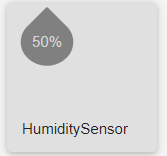
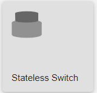
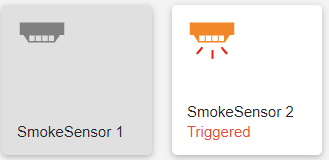
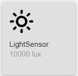

# homebridge-plc
Homebridge plugin for Siemens Step7 and compatible PLCs

SIEMENS S7 PLC plugin for [Homebridge](https://homebridge.io)
- Uses snap7 for communication therefore compatible with:
  * S7 300
  * S7 400
  * S7 1200 see [Snap7 notes](http://snap7.sourceforge.net/snap7_client.html#1200_1500)
  * S7 1500 see [Snap7 notes](http://snap7.sourceforge.net/snap7_client.html#1200_1500)
  * and compatible PLCs e.g. Yaskawa or VIPA
  * uses PG-Communication (programming device communication) to connect the PLC
  * optional also OP-Communication (HMI or panel communication) can be used for to connect the PLC
  * **NOTE:** You may need to increase the connection resources for PG-Communication or OP-Communication within Siemens Simatic Manager or Siemens TIA Portal. The default value is 1 and thus lead to connection problems using programming tool or panel and this plugin at the same time.
- Tested with S7-300, S7-1200 and S7-300 compatible PLCs from Yaskawa
- Implementation is based on documentation of the [Homebridge API](https://developers.homebridge.io)
- Supports [**polling**](#poll) of PLC from homebridge-plc plugin by per accessory defined interval
- Supports [**push**](#push) from PLC to homebridge-plc plugin by http PUT/GET
- Supports [**control**](#control) of PLC accessories by http PUT/GET
- Supported Accessories:
  * [LightBulb as `PLC_LightBulb`](#PLC_LightBulb)
  * [Outlet as `PLC_Outlet`](#PLC_Outlet)
  * [Switch as `PLC_Switch`](#PLC_Switch)
  * [Temperature Sensor as `PLC_TemperatureSensor`](#PLC_TemperatureSensor)
  * [Humidity Sensor as `PLC_HumiditySensor`](#PLC_HumiditySensor)
  * [Thermostat as `PLC_Thermostat`](#PLC_Thermostat)
  * [Humidifier/Dehumidifier as `PLC_HumidifierDehumidifier`](#PLC_HumidifierDehumidifier)
  * [Shutter as `PLC_WindowCovering`](#PLC_Window)
  * [Window as `PLC_Window`](#PLC_Window)
  * [Door as `PLC_Door`](#PLC_Window)
  * [Occupancy Sensor as `PLC_OccupancySensor`](#PLC_OccupancySensor)
  * [Motion Sensor as `PLC_MotionSensor`](#PLC_MotionSensor)
  * [Contact Sensor as `PLC_ContactSensor`](#PLC_ContactSensor)
  * [Contact Sensor as `PLC_LeakSensor`](#PLC_LeakSensor)
  * [Faucet as `PLC_Faucet`](#PLC_Faucet)
  * [Valve as `PLC_Valve`](#PLC_Valve)
  * [Security System as `PLC_SecuritySystem`](#PLC_SecuritySystem)
  * [Push button attached to PLC as `PLC_StatelessProgrammableSwitch`](#PLC_StatelessProgrammableSwitch)
  * [Doorbell push button attached to PLC as `PLC_Doorbell`](#PLC_StatelessProgrammableSwitch)
  * [Lock mechanism as `PLC_LockMechanism`](#PLC_LockMechanism)
  * [Boolean lock mechanism as `PLC_LockMechanismBool`](#PLC_LockMechanismBool)
  * [Garage door as `PLC_GarageDoorOpener`](#PLC_GarageDoorOpener)
  * [Smoke Sensor as `PLC_SmokeSensor`](#PLC_SmokeSensor)
  * [Fan as `PLC_Fan`](#PLC_Fan)
  * [Light Sensor as `PLC_LightSensor`](#PLC_LightSensor)

# Installation

- Basic Installation
  - Install this plugin using: `sudo npm install -g homebridge-plc`
  - Edit `config.json` to add the plc platform and its accessories.
  - Run Homebridge

- Install via Homebridge UI (recommended)
  - Search for `plc` on the plugin screen of [config-ui-x](https://github.com/oznu/homebridge-config-ui-x) .
  - Find `homebridge-plc`
  - Click install.
  - Edit configuration

# Homebridge configuration

## Platform

The plugin is configured as single platform by defining a `PLC` platform.
Parameters:
- `ip`: the IPv4 address of the PLC
- `rack`: the rack number of the PLC typically 0
- `slot`: the slot number of the PLC for S7 300/400 typically `2`, for 1200/1500 typically `1`.
- `communicationOP`: **(optional)** when set to `true` OP-Communication is used instead of PG-Communication
- `enablePolling`: **(optional)** when set to `true` a background task is executed every second enable polling for the accessories
- `defaultPollInterval` **(optional)** default polling interval for all accessories in seconds. Default value is `10` seconds
- `distributePolling` **(optional)** when set to `true` the polling of the accessories does not start at the same time. In order to distribute the PLC load for the queries
- `enablePush`: **(optional)** when set to `true` a the configured `port` is opened to push updates of values form plc to the plugin
- `enableControl`: **(optional)** when set to `true` a the configured `port` is opened to control accessories by http request
- `port`: **(optional)** port for http server to handle incoming http requests for push and control functionality. Default port is `8888`
- `forward`: **(optional)** there is a limit of maximum 149 supported accessories by homebridge. To overcome this is limited you can create a second instance of homebridge running homebridge-plc and forward all **push** and **control** with no matching `db`  to the other instance. Set the destination address of the second instance e.g. `http:\\127.0.0.1:8889`.
- `mirror` **(optional)** There are environments where it could make sense to share the same accessories on two homebridge instances. To allow pairing with another Home with Apple Home App or Home Assistant. This option mirrors all values read from PLC by this instance to a second instance. It also forwards all **push** requests to the second instance. The option `enablePush` has to be enabled on the second instance. on the destination instance.  Set the destination address of the second instance e.g. `http:\\192.168.1.11:8888`. (expirimental feature)
## Accessories
- In the platform, you can declare different types of accessories
- The notation **(push support)** identifies that parameter supports direct updates from the PLC
- The notation **(control support)** identifies parameters that can be controlled by http request

### LightBulb as `PLC_LightBulb`
normal light see also simple PLC example for [single bit](doc/ligtbulb_plc_example_SingleBit.png) and [separate bits](doc/ligtbulb_plc_example_SeperatedBit.png)

- `name`: unique name of the accessory
- `manufacturer`: **(optional)** description
- `db`: s7 data base number e.g. `4` for `DB4`
- `enablePolling`: **(optional)** when set to `true` the current state will be polled. It is mandatory as well to enable polling mode on platform level.
- `pollInterval`: **(optional)** poll interval in seconds. Default value see platform definition.
- `get_On`: **(push support)** offset and bit get the current status S7 type `Bool` e.g. `55.0` for `DB4DBX55.0`
- Single Bit for on/off:
  - `set_On`: **(control support)** offset and bit set to 1/0 when switching on/off S7 type `Bool` PLC e.g. `55.0` for `DB4DBX55.0` could be same as get_On
- Separate Bits for on/off:
  - `set_On`: **(control support)** offset and bit set to 1 when switching on S7 type `Bool` **PLC has to set to 0** e.g. `55.1` for `DB4DBX55.1`
  - `set_Off`: offset and bit set to 1 when switching off S7 type `Bool` **PLC has to set to 0** e.g. `55.2` for `DB4DBX55.2`
- `get_Brightness`: **(optional)** **(push support)** get brightness value S7 type `Byte` e.g. `56` for `DB4DBB56`
- `set_Brightness`: **(optional but required when `get_Brightness` is defined)** **(control support)** set brightness value S7 type `Byte` e.g. `57` for `DB4DBB57`
- brightness range definitions **(optional)**
  - `minBrightnessValue` default value: 0
  - `maxBrightnessValue` default value: 100
  - `minBrightnessStep` default value: 1

### Outlet as `PLC_Outlet`
outlet possible to show also as ventilator or light

- `name`: unique name of the accessory
- `manufacturer`: **(optional)** description
- `db`: s7 data base number e.g. `4` for `DB4`
- `enablePolling`: **(optional)** when set to `true` the current state will be polled. It is mandatory as well to enable polling mode on platform level.
- `pollInterval`: **(optional)** poll interval in seconds. Default value see platform definition.
- `get_On`: **(push support)** offset and bit get the current status S7 type `Bool` e.g. `55.0` for `DB4DBX55.0`
- Single Bit for on/off:
  - `set_On`: **(control support)** offset and bit set to 1/0 when switching on/off S7 type `Bool` PLC e.g. `55.0` for `DB4DBX55.0` could be same as get_On
- Separate Bits for on/off:
  - `set_On`: **(control support)** offset and bit set to 1 when switching on S7 type `Bool` **PLC has to set to 0** e.g. `55.1` for `DB4DBX55.1`
  - `set_Off`: offset and bit set to 1 when switching off S7 type `Bool` **PLC has to set to 0** e.g. `55.2` for `DB4DBX55.2`

### Switch as `PLC_Switch`
 switch possible to show also as ventilator or light

 
- `name`: unique name of the accessory
- `manufacturer`: **(optional)** description
- `db`: s7 data base number e.g. `4` for `DB4`
- `enablePolling`: **(optional)** when set to `true` the current state will be polled. It is mandatory as well to enable polling mode on platform level.
- `pollInterval`: **(optional)** poll interval in seconds. Default value see platform definition.
- `get_On`: **(push support)** offset and bit get the current status S7 type `Bool` e.g. `55.0` for `DB4DBX55.0`
- Single Bit for on/off:
  - `set_On`: **(control support)** offset and bit set to 1/0 when switching on/off S7 type `Bool` PLC e.g. `55.0` for `DB4DBX55.0` could be same as get_On
- Separate Bits for on/off:
  - `set_On`: **(control support)** offset and bit set to 1 when switching on S7 type `Bool` **PLC has to set to 0** e.g. `55.1` for `DB4DBX55.1`
  - `set_Off`: offset and bit set to 1 when switching off S7 type `Bool` **PLC has to set to 0** e.g. `55.2` for `DB4DBX55.2`

### Temperature Sensor as `PLC_TemperatureSensor`
normal temperature sensor

- `name`: unique name of the accessory
- `manufacturer`: **(optional)** description
- `db`: s7 data base number e.g. `4` for `DB4`
- `enablePolling`: **(optional)** when set to `true` the current state will be polled. It is mandatory as well to enable polling mode on platform level.
- `pollInterval`: **(optional)** poll interval in seconds. Default value see platform definition.
- Current Temperature
  - `get_CurrentTemperature`: **(push support)** offset to get current temperature S7 type `Real` e.g. `55` for `DB4DBD55`
  - Temperature range **(optional)**
    - `minTemperatureValue` default value: -270
    - `maxTemperatureValue` default value: 100
    - `minTemperatureStep` default value: 0.1
- `get_StatusTampered`: **(optional)** **(push support)** offset and bit to tamper detection. (Home app shows this only within the options) S7 type `Bool` e.g. `55.2` for `DB4DBX55.2`
  - `false`: ok
  - `true`: tampered
- `get_StatusLowBattery`: **(optional)** **(push support)** offset and bit to battery low detection. (Home app does not inform with push notification) S7 type `Bool` e.g. `55.3` for `DB4DBX55.3`
  - `false`: ok
  - `true`: battery low

### Humidity Sensor as `PLC_HumiditySensor`
normal humidity sensor

- `name`: unique name of the accessory
- `manufacturer`: **(optional)** description
- `db`: s7 data base number e.g. `4` for `DB4`
- `enablePolling`: **(optional)** when set to `true` the current state will be polled. It is mandatory as well to enable polling mode on platform level.
- `pollInterval`: **(optional)** poll interval in seconds. Default value see platform definition.
- Current Humidity
  - `get_CurrentRelativeHumidity`: **(push support)** offset to get current humidity S7 type `Real` e.g. `55` for `DB4DBD55`
  - Humidity range **(optional)**
    - `minHumidityValue` default value: 0
    - `maxHumidityValue` default value: 100
    - `minHumidityStep` default value: 1
- `get_StatusTampered`: **(optional)** **(push support)** offset and bit to tamper detection. (Home app shows this only within the options) S7 type `Bool` e.g. `55.2` for `DB4DBX55.2`
  - `false`: ok
  - `true`: tampered
- `get_StatusLowBattery`: **(optional)** **(push support)** offset and bit to battery low detection. (Home app does not inform with push notification) S7 type `Bool` e.g. `55.3` for `DB4DBX55.3`
  - `false`: ok
  - `true`: battery low

### Thermostat as `PLC_Thermostat`
temperature / humidity sensor with temperature / humidity regulation

- `name`: unique name of the accessory
- `manufacturer`: **(optional)** description
- `db`: s7 data base number e.g. `4` for `DB4`
- `enablePolling`: **(optional)** when set to `true` the current state will be polled. It is mandatory as well to enable polling mode on platform level.
- `pollInterval`: **(optional)** poll interval in seconds. Default value see platform definition.
- Current Temperature
  - `get_CurrentTemperature`: **(push support)** offset to get current temperature S7 type `Real` e.g. `0` for `DB4DBD0`
  - Temperature range **(optional)**
    - `minTemperatureValue` default value: -270
    - `maxTemperatureValue` default value: 100
    - `minTemperatureStep` default value: 0.1
- Target Temperature
  - `get_TargetTemperature`: **(push support)** offset to get target temperature S7 type `Real` e.g. `4` for `DB4DBD4`
  - `set_TargetTemperature`: **(control support)** offset to set current temperature S7 type `Real` e.g. `4` for `DB4DBD4` (can have same value as get_TargetTemperature)
  - Target temperature range definitions **(optional)**
    - `minTargetTemperatureValue` default value: 10
    - `maxTargetTemperatureValue` default value: 38
    - `minTargetTemperatureStep` default value: 0.1 **Note:** lower values seems not be supported by Homekit
  - Current Humidity
    - `get_CurrentRelativeHumidity`: **(optional)** **(push support)** offset to get current humidity S7 type `Real` e.g. `0` for `DB4DBD0`
  - Humidity range **(optional)**
    - `minHumidityValue` default value: 0
    - `maxHumidityValue` default value: 100
    - `minHumidityStep` default value: 1
- Target Humidity
  - `get_TargetRelativeHumidity`: **(optional)** **(push support)** offset to get target temperature S7 type `Real` e.g. `4` for `DB4DBD4`
  - `set_TargetRelativeHumidity`: **(optional)** **(control support)** offset to set current temperature S7 type `Real` e.g. `4` for `DB4DBD4` (can have same value as get_TargetTemperature)
  - Target relative humidity target range definitions **(optional)**
    - `minTargetHumidityValue` default value: 0
    - `maxTargetHumidityValue` default value: 100
    - `minTargetHumidityStep` default value: 1
- Current State:
  - `get_CurrentHeatingCoolingState`: **(optional)** **(push support)** offset to get current heating/cooling state S7 type `Byte` e.g. `8` for `DB4DBB8`. When not defined fixed `1`: heating is used.
    - `0`: inactive (shown as green in home app)
    - `1`: heating (shown as orange in home app)
    - `2`: cooling (shown as blue in home app)
  - `mapGetCurrentHeatingCoolingState`: **(optional)** define mapping array for `get_CurrentHeatingCoolingState`. The PLC value is used as index into the table. e.g. `[0, 2]` which maps the PLC value `0->0 1->2` when the PLC supports only two states with `0:inactive` and `1:cooling`.
- Target State:
  - `get_TargetHeatingCoolingState` **(optional)** **(push support)** offset to get target heating/cooling state. S7 type `Byte` e.g. `9` for `DB4DBB9`. When not defined fixed `3`: automatic is used.
    - `0`: off
    - `1`: heat
    - `2`: cool
    - `3`: automatic
  - `mapGetTargetHeatingCoolingState`: **(optional)** define mapping array for `get_TargetHeatingCoolingState`. The PLC value is used as index into the table. e.g. `[0, 3]` which maps the PLC value `0->0 1->3` when the PLC supports only two states with `0:off` and `1:automatic`.
  - `set_TargetHeatingCoolingState` **(optional)** **(control support)** offset to set target heating/cooling state. Can be identical with `get_TargetHeatingCoolingState`. Has to be defined when `get_TargetHeatingCoolingState` is defined. When not defined writes changes are ignored. S7 type `Byte` e.g. `9` for `DB4DBB9`.
    - `0`: off
    - `1`: heat
    - `2`: cool
    - `3`: automatic
  - `mapSetTargetHeatingCoolingState`: **(optional)** define mapping array for `set_TargetHeatingCoolingState`. The home app value is used as index into the table. e.g. `[0, 1, 0, 3]` which maps the PLC value `0->0 1->1 2->0, 3->3` when the PLC supports only two states with `0:off` and `1:heat` and `3:automatic`. The state cool is mapped to off.
- `get_StatusTampered`: **(optional)** **(push support)** offset and bit to tamper detection. (Home app shows this only within the options) S7 type `Bool` e.g. `55.2` for `DB4DBX55.2`
  - `false`: ok
  - `true`: tampered
- `get_StatusLowBattery`: **(optional)** **(push support)** offset and bit to battery low detection. (Home app does not inform with push notification) S7 type `Bool` e.g. `55.3` for `DB4DBX55.3`
  - `false`: ok
  - `true`: battery low

### Thermostat as `PLC_HumidifierDehumidifier`
Humidifier and/or Dehumidifier

- `name`: unique name of the accessory
- `manufacturer`: **(optional)** description
- `db`: s7 data base number e.g. `4` for `DB4`
- `enablePolling`: **(optional)** when set to `true` the current state will be polled. It is mandatory as well to enable polling mode on platform level.
- `pollInterval`: **(optional)** poll interval in seconds. Default value see platform definition.
- `get_CurrentRelativeHumidity`: **(push support)** offset to get current humidity S7 type `Real` e.g. `55` for `DB4DBD55`
- `get_Active`: **(push support)** offset and bit get the current status S7 type `Bool` e.g. `55.0` for `DB4DBX55.0`
- Single Bit for on/off:
  - `set_Active`: **(control support)** offset and bit set to 1/0 when switching on/off S7 type `Bool` PLC e.g. `55.0` for `DB4DBX55.0` could be same as get_Active
- Separate Bits for on/off:
  - `set_Active`: **(control support)** offset and bit set to 1 when switching on S7 type `Bool` **PLC has to set to 0** e.g. `55.1` for `DB4DBX55.1`
  - `set_Deactivate`: offset and bit set to 1 when switching off S7 type `Bool` **PLC has to set to 0** e.g. `55.2` for `DB4DBX55.2`
- Current State
  - `get_CurrentHumidifierDehumidifierState`: **(optional)** **(push support)** offset to get current state. Default value `1:idle`. S7 type `Byte` e.g. `55` for `DB4DBD55`
    - `0`: inactive
    - `1`: idle
    - `2`: humidifying
    - `3`: dehumidifying
  - `mapGetCurrentHumidifierDehumidifierState`: **(optional)** define mapping array for `get_CurrentHumidifierDehumidifierState`. The PLC value is used as index into the table. e.g. `[1, 3]` which maps the PLC value `0->1 1->3` when the PLC supports only two states with `0:idle` and `1:dehumidifying`.
- Target State
  - `default_TargetHumidifierDehumidifierState`: **(optional)** defines alternative value thats returned then `get_TargetHumidifierDehumidifierState` is not defined. Default value `0:auto`
    - `0`: auto (humidifier or dehumidifier)
    - `1`: humidifier
    - `2`: dehumidifier
  - `get_TargetHumidifierDehumidifierState`: **(optional)** **(push support)** offset to get current target state S7 type `Byte` e.g. `55` for `DB4DBD55`
    - `0`: auto (humidifier or dehumidifier)
    - `1`: humidifier
    - `2`: dehumidifier
  - `set_TargetHumidifierDehumidifierState`: **(optional)** **(control support)**offset to set current target state. Needs to be defined when `get_TargetHumidifierDehumidifierState` is set  S7 type `Byte` e.g. `55` for `DB4DBD55`
    - `0`: auto (humidifier or dehumidifier)
    - `1`: humidifier
    - `2`: dehumidifier
  - `mapGetTargetHumidifierDehumidifierState`: **(optional)** define mapping array for `get_TargetHumidifierDehumidifierState`. The PLC value is used as index into the table. e.g. `[0]` which maps the PLC value `0->2 1->3` when the PLC supports only one states with `0:dehumidifier.
  - `mapSetTargetHumidifierDehumidifierState`: **(optional)** define mapping array for `set_TargetHumidifierDehumidifierState`. The home app value is used as index into the table. e.g. `[2, 2, 2
- Rotation Speed
  - Byte
    - `get_RotationSpeedByte`: **(optional)** **(push support)** offset to get rotation speed state S7 type `Byte` e.g. `8` for `DB4DBB8`.
    - `set_RotationSpeedByte` **(optional but required when `set_RotationSpeedByte` is defined)** **(push support)** offset to get set speed state. S7 type `Byte` e.g. `9` for `DB4DBB9`.
  - Real
      - `get_RotationSpeed`: **(optional)** **(push support)** offset to get rotation speed state S7 type `Real` e.g. `8` for `DB4DBB8`.
      - `set_RotationSpeed` **(optional but required when `get_RotationSpeed` is defined)** **(push support)** offset to get set speed state. S7 type `Real` e.g. `9` for `DB4DBB9`.
- Swing Mode
  - `get_SwingMode`: **(optional)** **(push support)** offset to get rotation speed state S7 type `Bool` e.g. `8` for `DB4DBB8`.
  - `set_SwingMode` **(optional)** **(push support)** offset to get set speed state. S7 type `Bool` e.g. `9` for `DB4DBB9`.
- Water Level
  - `get_WaterLevel`: **(optional)** **(push support)** offset to get rotation speed state S7 type `Real` e.g. `8` for `DB4DBB8`.
- `get_StatusTampered`: **(optional)** **(push support)** offset and bit to tamper detection. (Home app shows this only within the options) S7 type `Bool` e.g. `55.2` for `DB4DBX55.2`
  - `false`: ok
  - `true`: tampered
- `get_StatusLowBattery`: **(optional)** **(push support)** offset and bit to battery low detection. (Home app does not inform with push notification) S7 type `Bool` e.g. `55.3` for `DB4DBX55.3`
  - `false`: ok
  - `true`: battery low

### Shutters as `PLC_WindowCovering`, windows as `PLC_Window` and doors as `PLC_Door`
motor driven blinds, windows and doors. Supports also manual driven blinds, windows and doors to show just the current position in percent. **Note:** If your sensor shows only open/close may also have a look at [`PLC_ContactSensor`](#PLC_ContactSensor).

  
- `name`: unique name of the accessory
- `manufacturer`: **(optional)** description
- `db`: s7 data base number e.g. `4` for `DB4`
- `adaptivePolling`: **(optional)** when set to `true` the current position will be polled until target position is reached. Polling starts with set target position from home app. This allows to show the shutter as opening... or closing... in the home app during movement.
- `adaptivePollingInterval` **(optional)** poll interval in seconds during high frequency polling. Default value is `1` second.
- `forceCurrentPosition` **(optional)** when set to `true` the position set by `set_TargetPosition` is directly used as current position. By this it seems in tha home app as the target position was directly reached. This is recommended when not using `adaptivePolling` or pushing the value from the plc.
- `enablePolling`: **(optional)** when set to `true` the current state will be polled. It is mandatory as well to enable polling mode on platform level.
- `pollInterval`: **(optional)** poll interval in seconds. Default value see platform definition.
- Current position:
  - `get_CurrentPosition`: **(push support)** offset to get current position `0:closed 100:open` S7 type `Byte` e.g. `0` for `DB4DBB0`
    - `0`: closed
    - `in between`: partly open
    - `100`: open
  - `invert`: **(optional)** set to `true` to inverts the values of current and target position from `0:closed 100:open` to `100:closed 0:open`
  - `mapGet`: **(optional)** define mapping array for get position. The PLC value is used as index into the table. e.g. `[0, 25, 100]` which maps the PLC value `0->0 1->25 2->100` this this is useful e.g. for window open state.
- Target position:
  - if one of the **(optional)** target position settings need specified all are needed. If not specified it os not movable ans sticks to current position.
  - `get_TargetPosition`: **(optional)** **(push support)** offset to get target position S7 type `Byte` e.g. `1` for `DB4DBB1` (can have same value as set_TargetPosition)
      - `0`: closed
      - `in between`: partly open
      - `100`: open
  - `set_TargetPosition`: **(optional)** **(control support)** offset to set current position `0:closed 100:open` S7 type `Byte` e.g. `2` for `DB4DBB2` (can have same value as get_TargetPosition)
    - `0`: closed
    - `in between`: partly open
    - `100`: open
  - `invert`: **(optional)** set to `true` to inverts the values of current and target position from `0:closed 100:open` to `100:closed 0:open`
- `get_PositionState`: **(optional)** **(push support)** offset to current movement state if not defined fixed `2`is returned S7 type `Byte` e.g. `3` for `DB4DBB3`
  - `0`: down
  - `1`: up
  - `2`: stop
- `set_HoldPosition`: **(optional)** **(control support)** offset and bit set to 1 to stop movement. (Seems not to be used) when not defined writes will be ignoredS7 type `Bool` **PLC has to set to 0** e.g. `55.1` for `DB4DBX55.1`

### Occupancy Sensor as `PLC_OccupancySensor`
presence detection sensor

- `name`: unique name of the accessory
- `manufacturer`: **(optional)** description
- `db`: s7 data base number e.g. `4` for `DB4`
- `invert`: **(optional)** set to `true` inverts the bit to `false:presence` and `true:no-presence`.
- `enablePolling`: **(optional)** when set to `true` the current state will be polled. It is mandatory as well to enable polling mode on platform level.
- `pollInterval`: **(optional)** poll interval in seconds. Default value see platform definition.
- `get_OccupancyDetected`: **(push support)** offset and bit get the current status S7 type `Bool` e.g. `55.0` for `DB4DBX55.0`
  - `false`: no occupancy
  - `true`: occupancy detected
- `get_StatusTampered`: **(optional)** **(push support)** offset and bit to tamper detection. (Home app shows this only within the options) S7 type `Bool` e.g. `55.2` for `DB4DBX55.2`
  - `false`: ok
  - `true`: tampered
- `get_StatusLowBattery`: **(optional)** **(push support)** offset and bit to battery low detection. (Home app does not inform with push notification) S7 type `Bool` e.g. `55.3` for `DB4DBX55.3`
  - `false`: ok
  - `true`: battery low

### Motion Sensor as `PLC_MotionSensor`
movement detection sensor

- `name`: unique name of the accessory
- `manufacturer`: **(optional)** description
- `db`: s7 data base number e.g. `4` for `DB4`
- `invert`: **(optional)** set to `true` inverts the bit to `false:motion` and `true:no-motion`.
- `enablePolling`: **(optional)** when set to `true` the current state will be polled. It is mandatory as well to enable polling mode on platform level.
- `pollInterval`: **(optional)** poll interval in seconds. Default value see platform definition.
- `get_MotionDetected`: **(push support)** offset and bit get the current status S7 type `Bool` e.g. `55.0` for `DB4DBX55.0`
  - `false`: no motion
  - `true`: motion detected
- `get_StatusTampered`: **(optional)** **(push support)** offset and bit to tamper detection. (Home app shows this only within the options) S7 type `Bool` e.g. `55.2` for `DB4DBX55.2`
  - `false`: ok
  - `true`: tampered
- `get_StatusLowBattery`: **(optional)** **(push support)** offset and bit to battery low detection. (Home app does not inform with push notification) S7 type `Bool` e.g. `55.3` for `DB4DBX55.3`
  - `false`: ok
  - `true`: battery low

### Contact Sensor as `PLC_ContactSensor`
generic contact sensor. The home app allows to display as window, door, blind/shutter, garage door or contact sensor.

    
- `name`: unique name of the accessory
- `manufacturer`: **(optional)** description
- `db`: s7 data base number e.g. `4` for `DB4`
- `invert`: **(optional)** set to `true` inverts the bit to `false:closed` and `true:open`.
- `enablePolling`: **(optional)** when set to `true` the current state will be polled. It is mandatory as well to enable polling mode on platform level.
- `pollInterval`: **(optional)** poll interval in seconds. Default value see platform definition.
- `get_ContactSensorState`: **(push support)** offset and bit get the current status S7 type `Bool` e.g. `55.0` for `DB4DBX55.0`
  - `false`: closed
  - `true`: open
- `get_StatusTampered`: **(optional)** **(push support)** offset and bit to tamper detection. (Home app shows this only within the options) S7 type `Bool` e.g. `55.2` for `DB4DBX55.2`
  - `false`: ok
  - `true`: tampered
- `get_StatusLowBattery`: **(optional)** **(push support)** offset and bit to battery low detection. (Home app does not inform with push notification) S7 type `Bool` e.g. `55.3` for `DB4DBX55.3`
  - `false`: ok
  - `true`: battery low

### Contact Sensor as `PLC_LeakSensor`
leak sensor

- `name`: unique name of the accessory
- `manufacturer`: **(optional)** description
- `db`: s7 data base number e.g. `4` for `DB4`
- `invert`: **(optional)** set to `true` inverts the bit to `false:closed` and `true:open`.
- `enablePolling`: **(optional)** when set to `true` the current state will be polled. It is mandatory as well to enable polling mode on platform level.
- `pollInterval`: **(optional)** poll interval in seconds. Default value see platform definition.
- `get_LeakDetected`: **(push support)** offset and bit get the current status S7 type `Bool` e.g. `55.0` for `DB4DBX55.0`
  - `false`: leak not detected
  - `true`: leak detected
- `get_StatusTampered`: **(optional)** **(push support)** offset and bit to tamper detection. (Home app shows this only within the options) S7 type `Bool` e.g. `55.2` for `DB4DBX55.2`
  - `false`: ok
  - `true`: tampered
- `get_StatusLowBattery`: **(optional)** **(push support)** offset and bit to battery low detection. (Home app does not inform with push notification) S7 type `Bool` e.g. `55.3` for `DB4DBX55.3`
  - `false`: ok
  - `true`: battery low

### Faucet as `PLC_Faucet`
watering for the garden

- `name`: unique name of the accessory
- `manufacturer`: **(optional)** description
- `db`: s7 data base number e.g. `4` for `DB4`
- `enablePolling`: **(optional)** when set to `true` the current state will be polled. It is mandatory as well to enable polling mode on platform level.
- `pollInterval`: **(optional)** poll interval in seconds. Default value see platform definition.
- `get_Active`: **(push support)** offset and bit get the current status S7 type `Bool` e.g. `55.0` for `DB4DBX55.0`
- Single Bit for on/off:
  - `set_Active`: **(control support)** offset and bit set to 1/0 when switching on/off S7 type `Bool` PLC e.g. `55.0` for `DB4DBX55.0` could be same as get_Active
- Separate Bits for on/off:
  - `set_Active`: **(control support)** offset and bit set to 1 when switching on S7 type `Bool` **PLC has to set to 0** e.g. `55.1` for `DB4DBX55.1`
  - `set_Deactivate`: offset and bit set to 1 when switching off S7 type `Bool` **PLC has to set to 0** e.g. `55.2` for `DB4DBX55.2`

### Valve as `PLC_Valve`
valve configurable as generic valve, irrigation, shower head or water faucet

- `name`: unique name of the accessory
- `manufacturer`: **(optional)** description
- `db`: s7 data base number e.g. `4` for `DB4`
- `enablePolling`: **(optional)** when set to `true` the current state will be polled. It is mandatory as well to enable polling mode on platform level.
- `pollInterval`: **(optional)** poll interval in seconds. Default value see platform definition.
- `ValveType` configures the valve type that is returned
  - `0`: generic valve
  - `1`: irrigation
  - `2`: shower head
  - `3`: water faucet
- `get_Active`: **(push support)** offset and bit get the current status S7 type `Bool` e.g. `55.0` for `DB4DBX55.0`
- Single Bit for on/off:
  - `set_Active`: **(control support)** offset and bit set to 1/0 when switching on/off S7 type `Bool` PLC e.g. `55.0` for `DB4DBX55.0` could be same as get_Active
- Separate Bits for on/off:
  - `set_Active`: **(control support)** offset and bit set to 1 when switching on S7 type `Bool` **PLC has to set to 0** e.g. `55.1` for `DB4DBX55.1`
  - `set_Deactivate`: offset and bit set to 1 when switching off S7 type `Bool` **PLC has to set to 0** e.g. `55.2` for `DB4DBX55.2`
- if one of the **(optional)** duration settings need specified all are needed
  - `get_SetDuration`: **(optional)** **(push support)** duration 0..3600 sec S7 type `Time` e.g. `10` for `DB4DBD10`
  - `set_SetDuration`: **(optional)** **(control support)** duration 0..3600 sec S7 type `Time` e.g. `14` for `DB4DBD14`
  - `get_RemainingDuration`: **(optional)** **(push support)** duration 0..3600 sec S7 type `Time` e.g. `18` for `DB4DBD18`

### Security System as `PLC_SecuritySystem`:
alarm system

- `name`: unique name of the accessory
- `manufacturer`: **(optional)** description
- `db`: s7 data base number e.g. `4` for `DB4`
- `enablePolling`: **(optional)** when set to `true` the current state of the security system will be polled.
- `pollInterval`: **(optional)** poll interval in seconds. Default value see platform definition.
- Current State:
  - `get_SecuritySystemCurrentState`: **(push support)** offset to current security system state S7 type `Byte` e.g. `3` for `DB4DBB3`
    - `0`: armed stay at home
    - `1`: armed away from home
    - `2`: armed night
    - `3`: disarmed
    - `4`: alarm triggered
  - `mapGetSecuritySystemCurrentState`: **(optional)** define mapping array for get security system state. The PLC value is used as index into the table. e.g. `[3, 1]` which maps the PLC value `0->3 1->2` when the PLC supports only two states with `0:disarmed` and `1:armed` and `2:alarm`.
- Target State:
  - `set_SecuritySystemTargetState`: **(control support)** offset to set target security system state S7 type `Byte` e.g. `5` for `DB4DBB4`
  - `get_SecuritySystemTargetState`: **(push support)** offset to set target security system state S7 type `Byte` e.g. `6` for `DB4DBB6`
    - `0`: armed stay at home
    - `1`: armed away from home
    - `2`: armed night
    - `3`: disarmed
  - `mapSetSecuritySystemTargetState`: **(optional)** define mapping array for set security system state. The home app value is used as index into the table. e.g. `[1, 1, 1, 0, 2]` which maps the PLC value `0->1 1->1 2->1, 3->0, 4->2` when the PLC supports only two states with `0:disarmed` and `1:armed` and `2:alarm`.
  - `mapGetSecuritySystemTargetState`: **(optional)** define mapping array for get security system state. The PLC value is used as index into the table. e.g. `[3, 1]` which maps the PLC value `0->3 1->2` when the PLC supports only two states with `0:disarmed` and `1:armed` and `2:alarm`.

### Button as `PLC_StatelessProgrammableSwitch`, Doorbell as `PLC_Doorbell`
stateless switch from PLC to home app.

Trigger actions in home app only works with control center e.g. AppleTV or HomePod. [**Polling**](#poll) or [**push**](#push) from PLC required!\
[**Polling mode**](#poll) homebridge-plc polls `isEvent`. The PLC sets the bit to `true`. hombebridge-plc reads `get_ProgrammableSwitchEvent` and set the `isEvent` bit to `false`.\
[**Push mode**](#push) PLC informs homebridge-plc by http request with the value for `get_ProgrammableSwitchEvent`.\
[**Control**](#control) External simulates event by http request with the value for `get_ProgrammableSwitchEvent`.

- `name`: unique name of the accessory
- `manufacturer`: **(optional)** description
- `db`: s7 data base number e.g. `4` for `DB4`
- `enablePolling`: **(optional)** when set to `true` the current state will be polled. It is mandatory as well to enable polling mode on platform level.
- `pollInterval`: **(optional)** poll interval in seconds. Default value see platform definition.
- `isEvent` offset and bit that is polled by homebridge-plc. **PLC has to set to `true`.** When `true` the event is read from `get_ProgrammableSwitchEvent` and set to `false` by homebirdge-plc to confirm that the event is handled. S7 type `Bool` e.g. `55.1` for `DB4DBX55.1` (polling only, not used for push)
- `get_ProgrammableSwitchEvent`: **(push support)** **(control support)** offset to read current event of the switch. This is reported towards home app S7 type `Byte` e.g. `3` for `DB4DBB3`
  - `0`: single press
  - `1`: double press
  - `2`: long press

### Lock mechanism as `PLC_LockMechanism`
lock mechanism

- `name`: unique name of the accessory
- `manufacturer`: **(optional)** description
- `db`: s7 data base number e.g. `4` for `DB4`
- `enablePolling`: **(optional)** when set to `true` the current state will be polled. It is mandatory as well to enable polling mode on platform level.
- `pollInterval`: **(optional)** poll interval in seconds. Default value see platform definition.
- `forceCurrentLockState`: **(optional)** when set to `true` the position set by `set_LockTargetState` is directly used as current state. By this it seems in the home app as the target state was directly reached. This is recommended when not using `enablePolling` or pushing the value from the plc.
  - `get_LockCurrentState`: **(push support)** offset to read current state current state S7 type `Byte` e.g. `3` for `DB4DBB3`
    - `0`: unsecured
    - `1`: secured
    - `2`: jammed
    - `3`: unknown
- `get_LockTargetState`: **(push support)** offset to read target state current state S7 type `Byte` e.g. `3` for `DB4DBB3`
  - `0`: unsecured
  - `1`: secured
- `set_LockTargetState`: **(control support)** offset to write target state current state S7 type `Byte` e.g. `3` for `DB4DBB3`
  - `0`: unsecured
  - `1`: secured

### Boolean lock mechanism as `PLC_LockMechanismBool`
lock mechanism implemented as bool on the PLC
**NOTE: The convention `0`=`false`: closed/secured `1`=`true`: open/unsecured**

- `name`: unique name of the accessory
- `manufacturer`: **(optional)** description
- `db`: s7 data base number e.g. `4` for `DB4`
- `enablePolling`: **(optional)** when set to `true` the current state will be polled. t is mandatory as well to enable polling mode on platform level.
- `pollInterval`: **(optional)** poll interval in seconds. Default value see platform definition.
- `forceCurrentLockState`: **(optional)** when set to `true` the state set by `set_LockTargetState` is directly used as current state. By this it seems in the home app as the target state was directly reached. This is recommended when not using `enablePolling` or pushing the value from the plc.
- `invertLockState`: **(optional)** when set to `true` all states are inverted (current and target state) `false`: **unsecured** and `true`: **secured**.
- `get_LockCurrentStateBool`: **(push support)** offset to read current state current state S7 type `Bool` .g. `3.1` for `DB4DBB3`
  - `false`: secured
  - `true`: unsecured
- `get_LockTargetStateBool`: **(push support)** offset to read target state current state S7 type `Bool` e.. `3.1` for `DB4DBB3`
  - `false`: secured
  - `true`: unsecured
- Single Bit for secure/unsecured:
  - `set_LockTargetStateBool`: **(control support)** offset to write target state current state S7 type `Bool` e.g. `3.1` for `DB4DBB3`
    - `false`: secured
    - `true`: unsecured
- Separate Bits for secure/unsecured:
  - `set_LockTargetStateBool_Secured`: **(control support)** offset and bit set to `true` when switching to target state secured S7 type `Bool` **PLC has to set to `false`** e.g. `3.3` for `DB4DBX55.1`
  - `set_LockTargetStateBool_Unsecured`: offset and bit set to `true` when switching to target state unsecured S7 type `Bool` **PLC has to set to `false`** e.g. `3.4` for `DB4DBX55.2`

### Garage door as `PLC_GarageDoorOpener`
garage door

- `name`: unique name of the accessory
- `manufacturer`: **(optional)** description
- `db`: s7 data base number e.g. `4` for `DB4`
- `enablePolling`: **(optional)** when set to `true` the current state will be polled. It is mandatory as well to enable polling mode on platform level.
- `pollInterval`: **(optional)** poll interval in seconds. Default value see platform definition.
- `forceCurrentDoorState`: **(optional)** when set to `true` the position set by `set_TargetDoorState` is directly used as current state. By this it seems in the home app as the target state was directly reached. This is recommended when not using `enablePolling` or pushing the value from the plc.
- `get_ObstructionDetected` **(optional)** **(push support)** offset and bit to obfuscation detection true means that the door was blocked S7 type `Bool` e.g. `55.1` for `DB4DBX55.1`
- `get_CurrentDoorState`: **(push support)** offset to read current state current state S7 type `Byte` e.g. `3` for `DB4DBB3`
  - `0`: open
  - `1`: closed
  - `2`: opening
  - `3`: closing
  - `4`: stopped
- `get_TargetDoorState`: **(push support)** offset to read target state current state S7 type `Byte` e.g. `3` for `DB4DBB3`
  - `0`: open
  - `1`: closed
- `set_TargetDoorState`: **(control support)** offset to write target state current state S7 type `Byte` e.g. `3` for `DB4DBB3`
  - `0`: open
  - `1`: closed

### Smoke Sensor as `PLC_SmokeSensor`
fire alarm

- `name`: unique name of the accessory
- `manufacturer`: **(optional)** description
- `db`: s7 data base number e.g. `4` for `DB4`
- `enablePolling`: **(optional)** when set to `true` the current state will be polled. It is mandatory as well to enable polling mode on platform level.
- `pollInterval`: **(optional)** poll interval in seconds. Default value see platform definition.
- `get_SmokeDetected`: **(push support)** offset and bit to smoke detection. S7 type `Bool` e.g. `55.1` for `DB4DBX55.1`
  - `false`: ok
  - `true`: smoke detected
- `get_StatusTampered`: **(optional)** **(push support)** offset and bit to tamper detection. (Home app shows this only within the options) S7 type `Bool` e.g. `55.2` for `DB4DBX55.2`
  - `false`: ok
  - `true`: tampered
- `get_StatusLowBattery`: **(optional)** **(push support)** offset and bit to battery low detection. (Home app does not inform with push notification) S7 type `Bool` e.g. `55.3` for `DB4DBX55.3`
  - `false`: ok
  - `true`: battery low

### Fan as `PLC_Fan`
ventilator

- `name`: unique name of the accessory
- `manufacturer`: **(optional)** description
- `db`: s7 data base number e.g. `4` for `DB4`
- `enablePolling`: **(optional)** when set to `true` the current state will be polled. It is mandatory as well to enable polling mode on platform level.
- `pollInterval`: **(optional)** poll interval in seconds. Default value see platform definition.
- Current State:
  - `default_CurrentFanState`: **(optional)** defines alternative value thats returned then `get_CurrentFanState` is not defined. Default value `0:inactive
  - ``: **(optional)** **(push support)** offset to get current heating/cooling state S7 type `Byte` e.g. `8` for `DB4DBB8`.
    - `0`: inactive
    - `1`: idle
    - `2`: blowing
  - `mapCurrentGet`: **(optional)** define mapping array for `get_CurrentFanState`. The PLC value is used as index into the table. e.g. `[0, 2]` which maps the PLC value `0->1 1->2` when the PLC supports only two states with `0:idle` and `1:blowing`.
- Target State:
  - `default_TargetFanState`: **(optional)** defines alternative value thats returned then `get_TargetFanState` is not defined. Default value `0:manual`
    - `0`: manual
    - `1`: automatic
  - `get_TargetFanState` **(optional)** **(push support)** offset to get target heating/cooling state. S7 type `Byte` e.g. `9` for `DB4DBB9`. When not defined fixed `1`: automatic is used.
    - `0`: manual
    - `1`: automatic
  - `set_TargetFanState` **(optional but required when `get_TargetFanState` is defined)** **(control support)** offset to get target heating/cooling state. S7 type `Byte` e.g. `9` for `DB4DBB9`. When not defined fixed `1`: automatic is used.
    - `0`: manual
    - `1`: automatic
  - `mapTargetGet`: **(optional)** define mapping array for `get_TargetFanState`. The PLC value is used as index into the table. e.g. `[1, 0]` which maps the PLC value `0->1 1->0` when the PLC supports only two states with `0:automatic` and `1:manual`.
  - `mapTargetSet`: **(optional)** define mapping array for `set_TargetFanState`. The home app value is used as index into the table. e.g. `[1, 0]` which maps the PLC value `0->1 1->0` when the PLC supports only two states with `0:automatic` and `1:manual`.
- Rotation Direction
  - get_RotationDirection **(optional)** **(push support)** offset to get rotation direction state. S7 type `Byte` e.g. `9` for `DB4DBB9`. When not defined fixed `0`: clockwise is used.
    - `0`: clockwise
    - `1`: counter clockwise
  - set_RotationDirection **(optional)** **(control support)** offset to set rotation directionstate. S7 type `Byte` e.g. `9` for `DB4DBB9`.
    - `0`: clockwise
    - `1`: counter clockwise
  - `mapDirectionGet`: **(optional)** define mapping array for `get_RotationDirection`. The PLC value is used as index into the table. e.g. `[1, 0]` inverts the direction.
  - `mapDirectionSet`: **(optional)** define mapping array for `set_RotationDirection`. The home app value is used as index into the table. e.g. `[1, 0]` inverts the direction.
- Rotation Speed
  - Byte
    - `get_RotationSpeedByte`: **(optional)** **(push support)** offset to get rotation speed state S7 type `Byte` e.g. `8` for `DB4DBB8`.
    - `set_RotationSpeedByte` **(optional but required when `set_RotationSpeedByte` is defined)** **(push support)** offset to get set speed state. S7 type `Byte` e.g. `9` for `DB4DBB9`.
  - Real
    - `get_RotationSpeed`: **(optional)** **(push support)** offset to get rotation speed state S7 type `Real` e.g. `8` for `DB4DBB8`.
    - `set_RotationSpeed` **(optional but required when `get_RotationSpeed` is defined)** **(push support)** offset to get set speed state. S7 type `Real` e.g. `9` for `DB4DBB9`.
- `get_Active`: **(push support)** offset and bit get the current status S7 type `Bool` e.g. `55.0` for `DB4DBX55.0`
- Single Bit for on/off:
  - `set_Active`: **(control support)** offset and bit set to 1/0 when switching on/off S7 type `Bool` PLC e.g. `55.0` for `DB4DBX55.0` could be same as get_Active
- Separate Bits for on/off:
  - `set_Active`: **(control support)** offset and bit set to 1 when switching on S7 type `Bool` **PLC has to set to 0** e.g. `55.1` for `DB4DBX55.1`
  - `set_Deactivate`: offset and bit set to 1 when switching off S7 type `Bool` **PLC has to set to 0** e.g. `55.2` for `DB4DBX55.2`

### Light Sensor as `PLC_LightSensor` or `PLC_LightSensor_DInt`
Illuminance sensor

- `name`: unique name of the accessory
- `manufacturer`: **(optional)** description
- `db`: s7 data base number e.g. `4` for `DB4`
- `enablePolling`: **(optional)** when set to `true` the current state will be polled. It is mandatory as well to enable polling mode on platform level.
- `pollInterval`: **(optional)** poll interval in seconds. Default value see platform definition.
- AmbientLightLevel
  - DInt
    - `get_CurrentAmbientLightLevelDInt`: **(push support)** offset to get current illumination in LUX S7 type `DInt` value limited to 0.0001 ~ 100,000   e.g. `55` for `DB4DBD55`
  - Real
    - `get_CurrentAmbientLightLevel`: **(push support)** offset to get current illumination in LUX S7 type `Real` value limited to 0.0001 ~ 100,000   e.g. `55` for `DB4DBD55`
- `get_StatusTampered`: **(optional)** **(push support)** offset and bit to tamper detection. (Home app shows this only within the options) S7 type `Bool` e.g. `55.2` for `DB4DBX55.2`
  - `false`: ok
  - `true`: tampered
- `get_StatusLowBattery`: **(optional)** **(push support)** offset and bit to battery low detection. (Home app does not inform with push notification) S7 type `Bool` e.g. `55.3` for `DB4DBX55.3`
  - `false`: ok
  - `true`: battery low

## config.json Example
Note: The example is just an example it contains also some optional settings. For testing purposes all accessories are set to one DB.

    {
      "bridge": {
        "name": "Homebridge DEMO",
        "username": "0E:54:47:36:82:26",
        "port": 52609,
        "pin": "031-55-155"
      },
      "accessories": [],
      "platforms": [
        {
          "name": "Config",
          "port": 8888,
          "platform": "config"
        },
        {
          "platform": "PLC",
          "ip": "10.10.10.32",
          "rack": 0,
          "slot": 2,
          "communicationOP": false,
          "enablePolling": true,
          "defaultPollInterval": 15,
          "distributePolling": true,
          "enablePush": true,
          "enableControl": true,
          "port": 8888,
          "accessories": [
            {
              "accessory": "PLC_LightBulb",
              "name": "LightBulb0",
              "manufacturer": "normal light bulb",
              "enablePolling": true,
              "db": 12,
              "get_On": 0.0,
              "set_On": 0.1,
              "set_Off": 0.2
            },
            {
              "accessory": "PLC_LightBulb",
              "name": "LightBulb1",
              "manufacturer": "with dim function",
              "enablePolling": true,
              "db": 12,
              "get_On": 2.0,
              "set_On": 2.1,
              "set_Off": 2.2,
              "get_Brightness": 1,
              "set_Brightness": 1
            },
            {
              "accessory": "PLC_LightBulb",
              "name": "LightBulb2",
              "manufacturer": "single bit for on/off",
              "enablePolling": true,
              "db": 12,
              "get_On": 2.3,
              "set_On": 2.3
            },
            {
              "accessory": "PLC_Outlet",
              "name": "Outlet",
              "enablePolling": true,
              "db": 12,
              "get_On": 2.4,
              "set_On": 2.5
            },
            {
              "accessory": "PLC_Switch",
              "name": "Switch",
              "enablePolling": true,
              "db": 12,
              "get_On": 2.6,
              "set_On": 2.7,
              "set_Off": 3.0
            },
            {
              "accessory": "PLC_TemperatureSensor",
              "name": "Temperature",
              "db": 12,
              "get_CurrentTemperature": 4,
              "enablePolling": true,
              "pollInterval": 60
            },
            {
              "accessory": "PLC_HumiditySensor",
              "name": "Humidity",
              "db": 12,
              "get_CurrentRelativeHumidity": 8,
              "enablePolling": true,
              "pollInterval": 120
            },
            {
              "accessory": "PLC_Thermostat",
              "name": "Thermostat",
              "manufacturer": "ground floor",
              "db": 12,
              "enablePolling": true,
              "get_CurrentTemperature": 12,
              "get_TargetTemperature": 16,
              "set_TargetTemperature": 16,
              "get_CurrentHeatingCoolingState": 20
              "mapSetTarget": [
                  0,
                  1,
                  0,
                  3
              ],
            },
            {
              "accessory": "PLC_WindowCovering",
              "name": "Blind",
              "manufacturer": "ground floor",
              "db": 12,
              "invert": false,
              "adaptivePolling": true,
              "adaptivePollingInterval": 1,
              "enablePolling": true,
              "pollInterval": 180,
              "get_CurrentPosition": 21,
              "get_TargetPosition": 22,
              "set_TargetPosition": 1
            },
            {
              "accessory": "PLC_Window",
              "name": "Window",
              "manufacturer": "ground floor",
              "enablePolling": true,
              "pollInterval": 60,
              "db": 12,
              "get_CurrentPosition": 23,
              "mapGet": [
                  0,
                  25,
                  100
              ]
            },
            {
              "accessory": "PLC_Door",
              "name": "Door",
              "manufacturer": "ground floor",
              "enablePolling": true,
              "pollInterval": 10,
              "db": 12,
              "get_CurrentPosition": 24,
              "mapGet": [
                  0,
                  100
              ]
            },
            {
              "accessory": "PLC_OccupancySensor",
              "name": "Presence",
              "enablePolling": true,
              "db": 12,
              "get_OccupancyDetected": 25.0
            },
            {
              "accessory": "PLC_MotionSensor",
              "name": "Motion",
              "enablePolling": true,
              "db": 12,
              "get_MotionDetected": 25.1
            },
            {
              "accessory": "PLC_ContactSensor",
              "name": "ContactSensor",
              "enablePolling": true,
              "pollInterval": 5,
              "db": 12,
              "get_ContactSensorState": 25.2
            },
            {
              "accessory": "PLC_LeakSensor",
              "name": "LeakSensor",
              "enablePolling": true
              "pollInterval": 5,
              "db": 12,
              "get_LeakDetected": 25.3,
            },
            {
              "accessory": "PLC_Faucet",
              "name": "Faucet",
              "enablePolling": true,
              "db": 12,
              "get_Active": 28.0,
              "set_Active": 28.0
            },
            {
              "accessory": "PLC_Valve",
              "name": "Valve",
              "db": 12,
              "enablePolling": true,
              "ValveType": 2,
              "get_Active": 28.1,
              "set_Active": 28.1,
              "get_SetDuration": 30,
              "set_SetDuration": 30,
              "get_RemainingDuration": 34
            },
            {
              "accessory": "PLC_SecuritySystem",
              "name": "SecuritySystem",
              "db": 12,
              "enablePolling": true,
              "pollInterval": 60,
              "get_SecuritySystemCurrentState": 26,
              "set_SecuritySystemTargetState": 27,
              "get_SecuritySystemTargetState": 27,
              "mapGetCurrent": [
                  3,
                  1,
                  4
              ],
              "mapGetTarget": [
                  3,
                  1
              ]
              "mapSetTarget": [
                  1,
                  1,
                  1,
                  0
              ]

            },
            {
              "accessory": "PLC_StatelessProgrammableSwitch",
              "name": "Stateless Switch",
              "enablePolling": true,
              "pollInterval": 10,
              "db": 12,
              "isEvent": 29.2,
              "get_ProgrammableSwitchEvent": 38
            },
            {
              "accessory": "PLC_Doorbell",
              "name": "Doorbell",
              "enablePolling": true,
              "pollInterval": 10,
              "db": 12,
              "isEvent": 29.2,
              "get_ProgrammableSwitchEvent": 38
            },
            {
              "accessory": "PLC_LockMechanism",
              "name": "Lock",
              "db": 12,
              "enablePolling": true,
              "get_LockCurrentState": 39,
              "get_LockTargetState": 40,
              "set_LockTargetState": 40
            },
            {
              "accessory": "PLC_LockMechanismBool",
              "name": "LockBool",
              "db": 12,
              "enablePolling": true,
              "get_LockCurrentState": 41.0,
              "get_LockTargetState": 41.1,
              "set_LockTargetState": 41.1
            },
            {
              "accessory": "PLC_GarageDoorOpener",
              "name": "GarageDoor",
              "db": 12,
              "enablePolling": true,
              "get_ObstructionDetected": 41.2,
              "get_CurrentDoorState": 42,
              "get_TargetDoorState": 43,
              "set_TargetDoorState": 43,
            },
            {
              "accessory": "PLC_SmokeSensor",
              "name": "SmokeSensor",
              "db": 12,
              "enablePolling": true,
              "get_SmokeDetected": 44.0,
              "get_StatusTampered": 44.1,
              "get_StatusLowBattery": 44.2
            },
            {
              "accessory": "PLC_Fan",
              "name": "Fan",
              "manufacturer": "Test",
              "db": 12,
              "set_Active": 44.3,
              "get_Active": 44.3,
              "get_RotationDirection": 45,
              "set_RotationDirection": 45,
              "get_RotationSpeed": 46,
              "set_RotationSpeed": 46,
              "get_CurrentFanState": 47,
              "get_TargetFanState": 48,
              "set_TargetFanState": 48,
              "enablePolling": true
            },
            {
                "accessory": "PLC_LightSensor",
                "name": "LightSensor",
                "db": 12,
                "enablePolling": true,
                "get_CurrentAmbientLightLevel": 50,
                "pollInterval": 180
            },
          ]
        }
      ]
    }

# Update of values
The home app does not regularly poll for updates of values. Only when switching rooms or close/open the app the actual values are requested.
This behavior is even the case when a AppleTV or HomePod is configured as control center.
There are three possible ways to workaround this.

1. That's ok for you
2. You enable the polling mode
3. You enable the push mode and instrument your PLC code to send the values

## Poll values form PLC by homebridge-PLC plugin
To enable this you have to set `"enablePolling": true;` platform level and on each individual accessory with individual interval in seconds `"enablePolling": true, "pollInterval": 10,`

Example to poll the contact sensor state every 10 seconds:

    {
      "platforms": [
          {
          "platform": "PLC",
          "ip": "10.10.10.32",
          "rack": 0,
          "slot": 2,
          "enablePolling": true,
          "accessories": [
            {
              "accessory": "PLC_ContactSensor",
              "name": "ContactSensor",
              "enablePolling": true,
              "pollInterval": 10,
              "db": 12,
              "get_ContactSensorState": 25.2
            }
          ]
        }
      ]
    }

## Push values from PLC to homebridge-plc plugin

It possible to send updates of values directly from the plc to the homebridge-plc plugin. This is especially useful when you want notifications form your home app about open/close of doors or just a faster response e.g. with PLC_StatelessProgrammableSwitch.
To enable this you have to set `"enablePush": true,` platform level and optional the `port`.

The push takes place via an http request to the configured port with the keyword "push". In order to avoid that additional configurations to be shared between the PLC and the homebrige-plc-Plugin, the interface is kept very simple.
The interface that the PLC has to use consists only of the keyword 'push', the database number 'db', the address within the db 'offset' and the value 'value'. This allows to on the PLC to create a simple interface to push changed values to the homebridge-plc plugin e.g. I created a FC with just one input of type `ANY` to push all kind of values.

The value is assigned to all matching ('db' and 'offset') get_* accessory configurations. All information is transmitted within the URL and in decimal. Parameters that supports push are marked with [push] in the description.

It's also possible to forward all push where no matching accessory no matches the `db` configuration to another instance of homebridge-plc see parameter `forward`.

For example the push from the PLC is done as 'http://homebridgeIp:8888/?push&db=1014&offset=1&value=3'
With the following configuration:

    {
      "platforms": [
          {
          "platform": "PLC",
          "ip": "10.10.10.32",
          "rack": 0,
          "slot": 2,
          "enablePush": true,
          "accessories": [
            {
                "accessory": "PLC_SecuritySystem",
                "name": "AlarmSystem",
                "db": 1014,
                "get_SecuritySystemCurrentState": 1,
                "set_SecuritySystemTargetState": 1,
                "get_SecuritySystemTargetState": 1
            }
          ]
        }
      ]
    }

The value '3' disarmed will be used for both for 'get_SecuritySystemCurrentState' as well as 'get_SecuritySystemTargetState'.

The Request has to be done as HTTP `PUT` or `GET` operation. There will be no logging when doing a `PUT` operation while there will be detailed output when during a `GET` operation. This in especially intended for testing with the browser as the browser performs a `GET` operation per default.

### Format
Example for float values when trigger from browser:

  http://homebridgeIp:8888/?push&db=3&offset=22&value=12.5

Example for bool values when trigger from browser

  http://homebridgeIp:8888/?push&db=5&offset=5.1&value=1

Example for byte values when trigger from browser

  http://homebridgeIp:8888/?push&db=2&offset=3&value=255

**NOTE:** Chrome/Edge does at minimum two requests with different parameters resulting in some error messages. I recommend `Talend API Tester - Free Edition`

# Control of PLC accessories

Its also possible to control PLC accessories via HTTP `PUT` or `GET` operation. This might be useful for integration into other automation systems.
To enable this you have to set `"enableControl": true,` platform level and optional the `port`.

**NOTE: It is currently not possible to query the current state**

The interface that the PLC operates consists only of the keyword 'control', the database number 'db', the address within the db 'offset' and the value 'value'.
The value is assigned to the matching ('db' and 'offset') set_* accessory configurations. All configurations that are supported are marked with **(control support)** in the description.

For accessories with separate on/off configurations e.g. `PLC_LightBulb` `set_On`/`set_Off` the `set_On` or `PLC_LockMechanismBool` `set_Secured`/`set_Unsecured` the `set_Secured` has to be used. With `1` for on and `0` for off.

All information is transmitted within the URL and in decimal.

It's also possible to forward all control requests where no matching accessory no matches the `db` configuration to another instance of homebridge-plc see parameter `forward`.

**NOTE: Options like `invert*`, `mapGet*` and `mapSet*` are not affecting the control interface. In example for PLC_Window is the value `0`: **closed** and `100`: **open** regardless if `invert` is set or not.

The Request has to be done as HTTP `PUT` or `GET` operation. There will be no logging when doing a `PUT` operation while there will be detailed output when during a `GET` operation. This in especially intended for testing with the browser as the browser performs a `GET` operation per default.

### Format
Example to switch a light bulb from browser. Lets say the light bulb has the following config:

  "platforms": [
      {
      "platform": "PLC",
      "ip": "10.10.10.32",
      "rack": 0,
      "slot": 2,
      "enableControl": true,
      "accessories": [
        {
            "accessory": "PLC_LightBulb",
            "name": "Light ",
            "db": 6096,
            "set_On": 1.1,
            "set_Off": 1.0,
            "get_On": 0.0
        }
      ]
    }
  ]

Use this to switch the light bulb on from browser:

  http://homebridgeIp:8888/?control&db=6096&offset=1.1&value=1

Use this to switch the light bulb off from browser:

  http://homebridgeIp:8888/?control&db=6096&offset=1.1&value=0

**NOTE:** Chrome/Edge does at minimum two requests with different parameters resulting in some error messages. I recommend `Talend API Tester - Free Edition`

# Test & Release

## Local test
The easiest is to open the terminal from homebridge delete the `index.js` file of this plugin, open nano and past in the new content.
Afterwards the Homebridge can be restarted.
The delete and open of hte index.js file can be done by the following command line.

`rm node_modules/homebridge-plc/index.js && nano node_modules/homebridge-plc/index.js`

## Publish npm package

`npm publish --access public`

